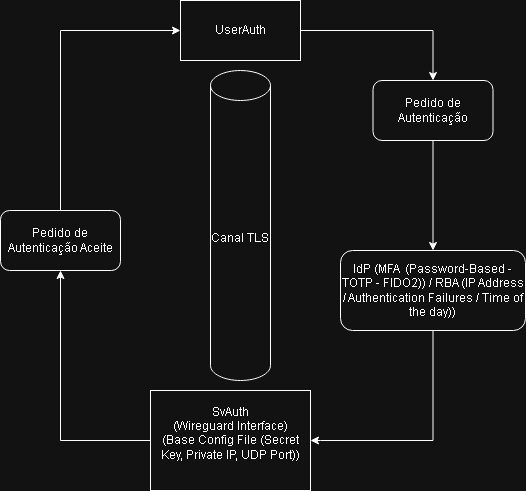

# IAA_WireGuard_VPN_User_Auth
This project focuses on designing and implementing a secure user authentication protocol for WireGuard VPN.

Project of Pedro Costa, Henrique Dias e Jorge Saénz

The workflow for this project:

